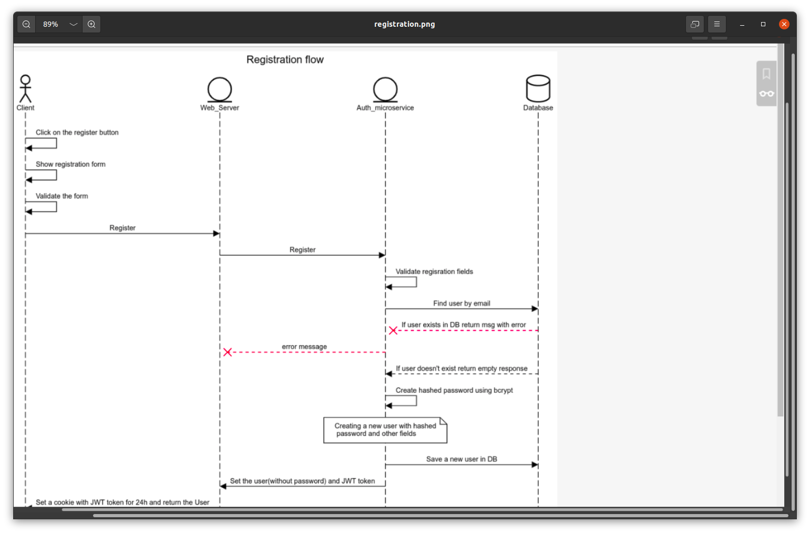

# Auto microservice

The authentication microservice that handles rest API of outside server   and provides auth of the user using JWT token
## Quick Run
clone the repo: git clone <name>  
### start microservice local:
install all dependencies in the root folder: npm i  
#### run microservice: npm start   
server listening on the port: 8080  
## Start WebServer
install dependency in the path docker_test/webServer:  1. cd docker_test/webServer  
2. npm i  
#### run webServer: npm start  
server listening on the port: 3030  

## Start Client
cd docker_test/webServer/client/  
install dependency: npm i 
#### run Client: npm start
You can now view client in the browser.  
Local: http://localhost:3000  

# Start App using docker:
build images: docker build -t auth_microservice .  
view images: docker images  
### run docker image
docker run <name image>: docker run auth_microservice  

## Test user registration/login locally
cd docker_test  
install dependency: npm i  
#### run test integration: npm start

## Test Jest
run all tests: npm test  

# Technologies  Included
Node using express library  
MongoDB using mongoose library  
Docker  
React  
JSX ES6  
MUI  
SCSS  
Jest  

# Sequence diagram
 If you want to see the sequence diagram use the next source: 
 ### https://sequencediagram.org/
# Login diagram
title Login flow

actor Client
entity Web_Server

entity Auth_microservice
database Database

Client->Client: Click on the login button
Client->Client: Show login form
Client->Client: Validate the form
Client->Web_Server: Login

Web_Server->Auth_microservice: Login
Auth_microservice->Auth_microservice: Validate login fields

Auth_microservice->Database: Find user by email
Database--#redxAuth_microservice: if user doesn't exist in DB return message error

Auth_microservice--#redxWeb_Server: Message error
Web_Server--#redxClient: Email or password wrong
Database-->Auth_microservice:Return the User

note over Auth_microservice:Compare between db password\n and user's password

Database--#redxAuth_microservice: If password doesn't match return message error
Auth_microservice--#redxWeb_Server: message error
Web_Server--#redxClient: Email or password wrong

Auth_microservice->Web_Server: Set user_id and JWT token in the response.

Web_Server->Client:Return the User object (without password) and jwt token that valid for 24h on the cookie
## image of login sequence diagram

# Registration diagram

title Registration flow

actor Client
entity Web_Server

entity Auth_microservice
database Database

Client->Client: Click on the register button
Client->Client: Show registration form
Client->Client: Validate the form
Client->Web_Server: Register

Web_Server->Auth_microservice: Register
Auth_microservice->Auth_microservice: Validate registration fields

Auth_microservice->Database: Find user by email
Database--#redxAuth_microservice: If user exists in DB return msg with error
Auth_microservice--#redxWeb_Server: error message

Database-->Auth_microservice: If user doesn't exist return empty response

Auth_microservice->Auth_microservice: Create hashed password using bcrypt
note over Auth_microservice: Creating a new user with hashed\n password and other fields

Auth_microservice->Database: Save a new user in DB
Auth_microservice->Web_Server: Set the user(without password) and JWT token

Web_Server->Client: Set a cookie with JWT token for 24h and return the User

## image of login sequence diagram
